# 🍋 Little Lemon

<p align="center">


</p>

<p align="center">
<strong>A responsive restaurant web application built with React.</strong><br>
Browse the menu, reserve a table, manage your shopping cart, and experience a modern restaurant website designed with responsiveness and usability in mind.
</p>

<p align="center">
<video src="./screenshots/little-lemon-demo.mp4" controls width="100%"></video>
</p>

---

# ✨ Overview

Little Lemon is a modern restaurant web application built with **React** using **Create React App** as part of the **Meta Front-End Developer Professional Certificate**.

The goal of the project was to build a complete restaurant experience that feels like a real-world application while demonstrating responsive layouts, reusable React components, routing, client-side validation, and shopping cart functionality.

Every page has been designed for both desktop and mobile users, ensuring a consistent experience across different screen sizes.

---

# 🚀 Features

- 🍽 Browse a complete restaurant menu
- 🛒 Fully functional shopping cart
- ➕ Increase and decrease item quantities
- 🗑 Remove items from the cart
- 💰 Live cart total calculations
- 🔍 Sort menu by:
  - Price
  - Calories
  - Alphabetically
- 🎯 Filter menu categories
- 📅 Reservation system with client-side validation
- 🔐 Login and Registration pages
- 📱 Responsive desktop and mobile layouts
- 🧭 Client-side routing with React Router

---

# 📸 Application Preview

## 🏠 Home Page

| Desktop                                                      | Mobile                                                            |
| ------------------------------------------------------------ | ----------------------------------------------------------------- |
| 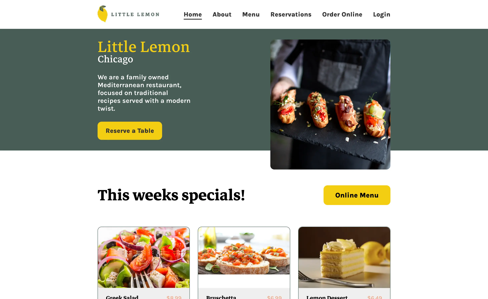 | 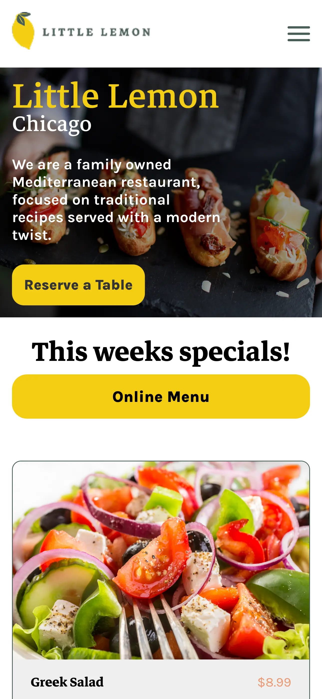 |

---

## ℹ️ About

| Desktop                                                   | Mobile                                                         |
| --------------------------------------------------------- | -------------------------------------------------------------- |
| 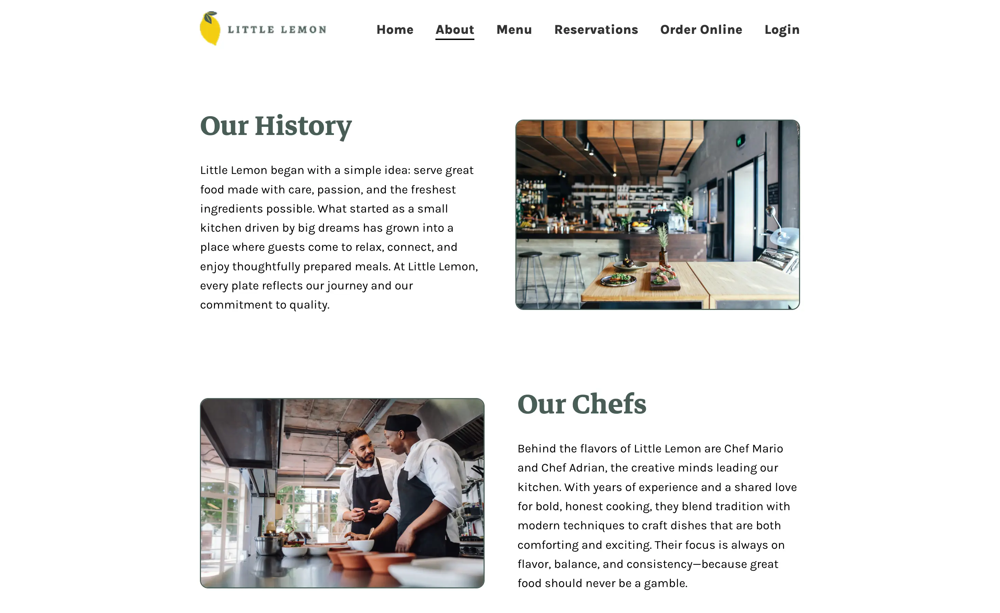 | 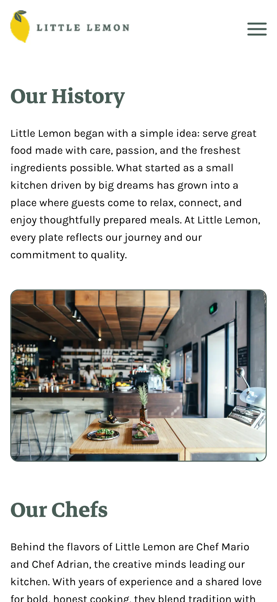 |

---

## 🍽 Menu

| Desktop                                                  | Mobile                                                        |
| -------------------------------------------------------- | ------------------------------------------------------------- |
| 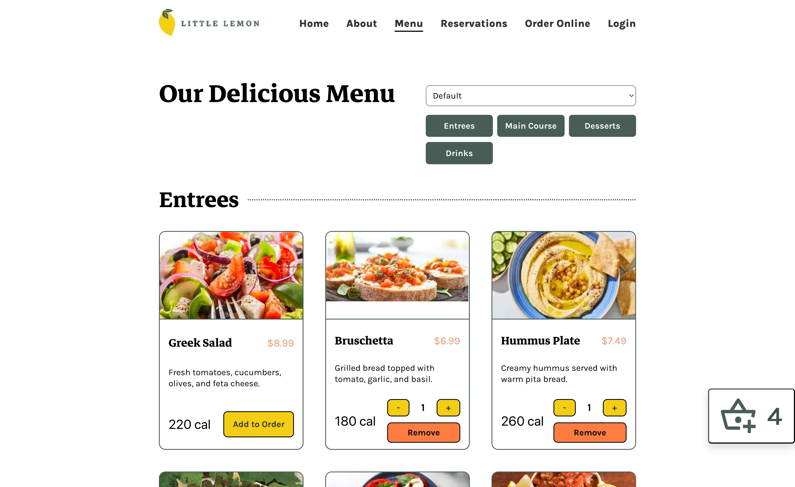 | 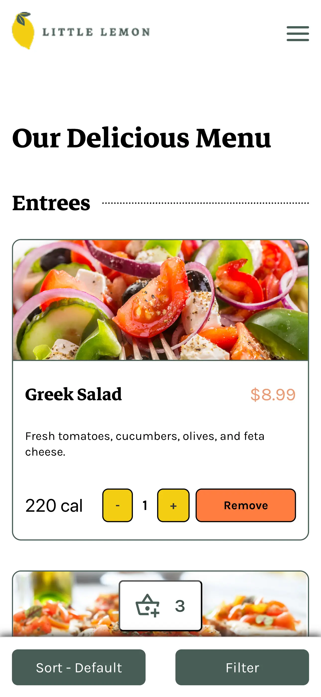 |

### Menu Highlights

- Sort dishes by price
- Sort dishes by calories
- Alphabetical sorting
- Filter categories
- Responsive mobile filter sheets
- Live shopping cart updates

---

## 🛒 Shopping Cart

| Desktop                                                   | Mobile                                                         |
| --------------------------------------------------------- | -------------------------------------------------------------- |
| 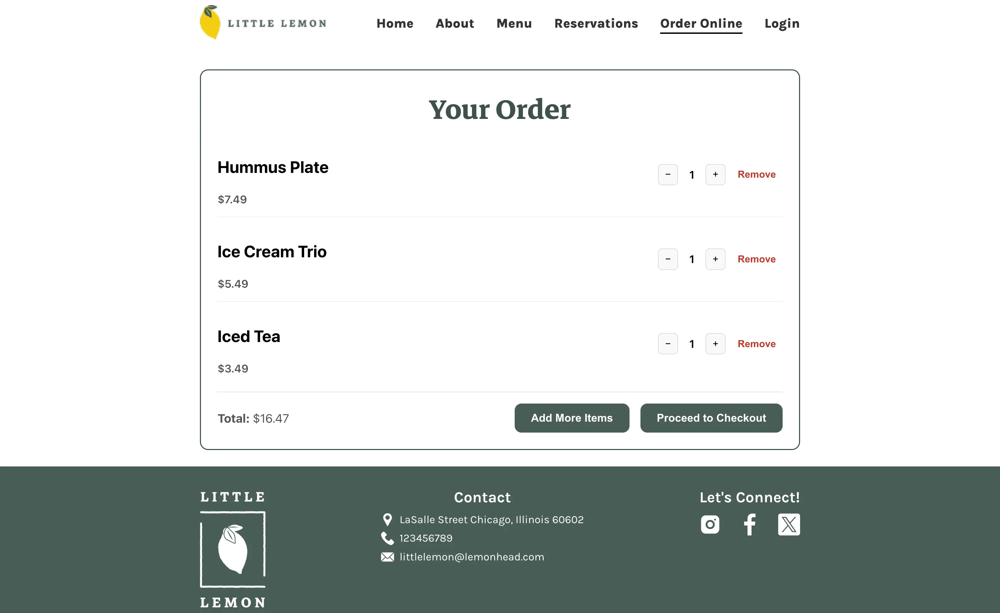 | 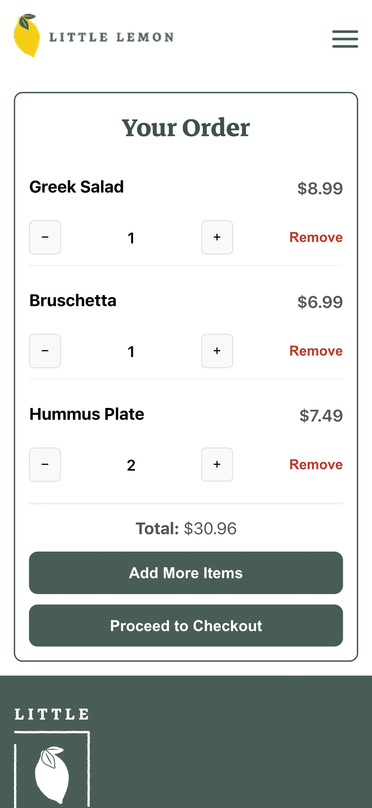 |

Shopping cart features include:

- Live quantity updates
- Dynamic total calculation
- Item removal
- Responsive checkout experience

---

## 📅 Reservation

| Desktop                                                         | Mobile                                                               |
| --------------------------------------------------------------- | -------------------------------------------------------------------- |
| 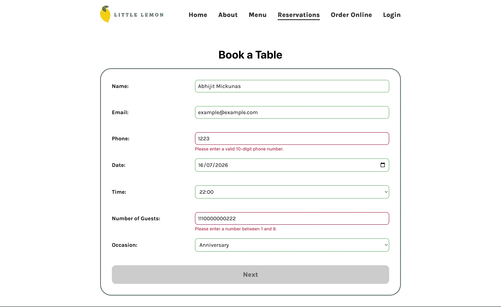 | 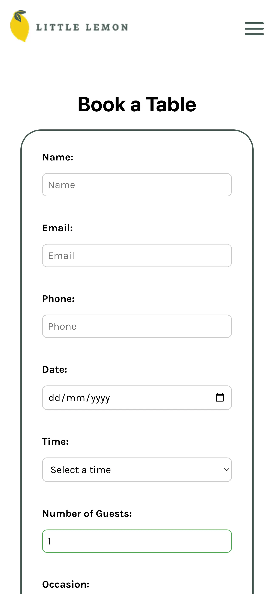 |

The reservation page includes comprehensive client-side validation to ensure users receive immediate feedback before submitting the form.

---

## 🔐 Login

| Desktop                                                   | Mobile                                                         |
| --------------------------------------------------------- | -------------------------------------------------------------- |
| 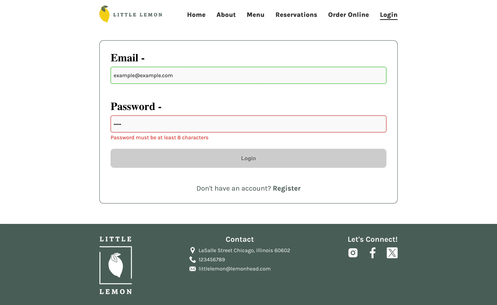 | 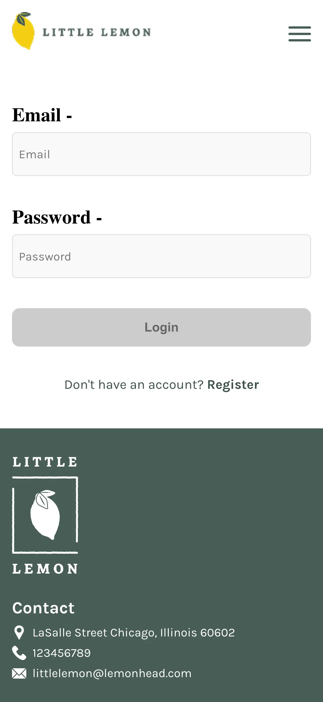 |

---

## 📝 Register

| Desktop                                                      | Mobile                                                            |
| ------------------------------------------------------------ | ----------------------------------------------------------------- |
| 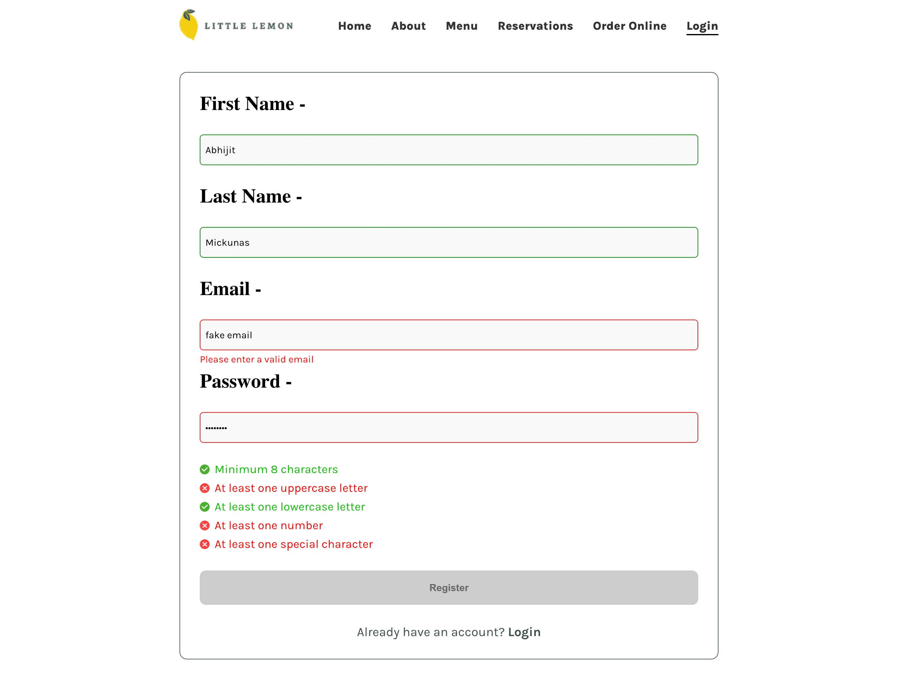 | 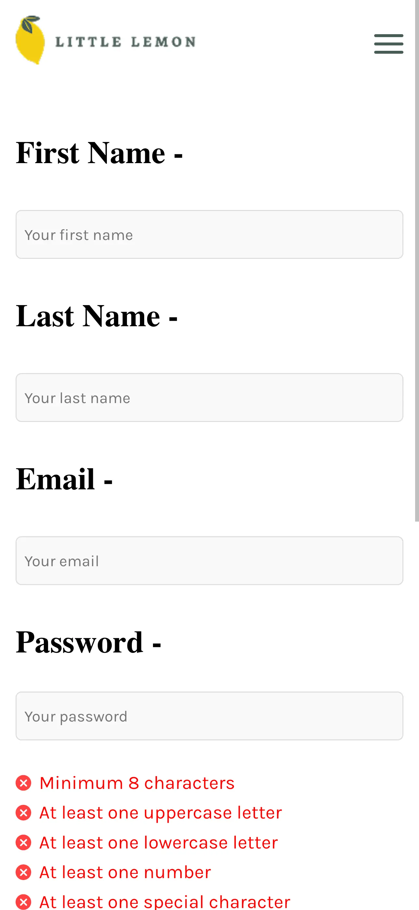 |

---

## 🍋 Footer

| Desktop                                                    | Mobile                                                          |
| ---------------------------------------------------------- | --------------------------------------------------------------- |
| 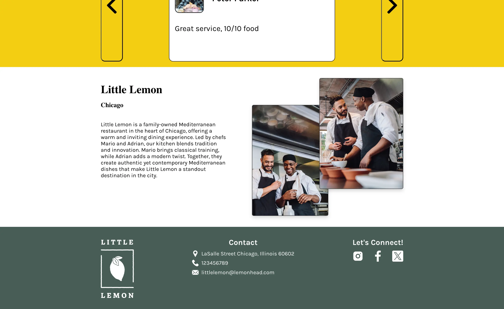 | 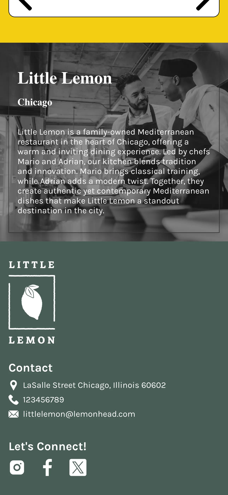 |

---

# 🏗 Tech Stack

| Technology        | Purpose             |
| ----------------- | ------------------- |
| React             | User Interface      |
| React Router      | Client-side Routing |
| JavaScript (ES6+) | Application Logic   |
| HTML5             | Markup              |
| CSS3              | Responsive Styling  |
| Create React App  | Project Scaffolding |

---

# 📂 Project Structure

```text
little-lemon-capstone
│
├── public/
├── screenshots/
│   ├── desktop/
│   ├── mobile/
│   └── little-lemon-demo.mp4
│
├── src/
│   ├── assets/
│   ├── components/
│   ├── pages/
│   ├── App.js
│   └── index.js
│
├── package.json
└── README.md
```

---

# ⚙️ Getting Started

Clone the repository

```bash
git clone https://github.com/abhi-ghosh/little-lemon-capstone.git
```

Navigate into the project

```bash
cd little-lemon-capstone
```

Install dependencies

```bash
npm install
```

Start the development server

```bash
npm start
```

Create a production build

```bash
npm run build
```

---

# 🧠 What I Learned

Building Little Lemon helped strengthen my understanding of:

- Building larger React applications
- Creating reusable components
- Responsive web design
- Client-side routing with React Router
- Client-side form validation
- Shopping cart state management
- Organizing scalable project structures
- Creating polished user experiences across desktop and mobile

---

# 📄 License

This project was created for educational purposes as part of the **Meta Front-End Developer Professional Certificate**.

---

<p align="center">
Built with ❤️ by <strong>Abhijit Ghosh</strong>
</p>
